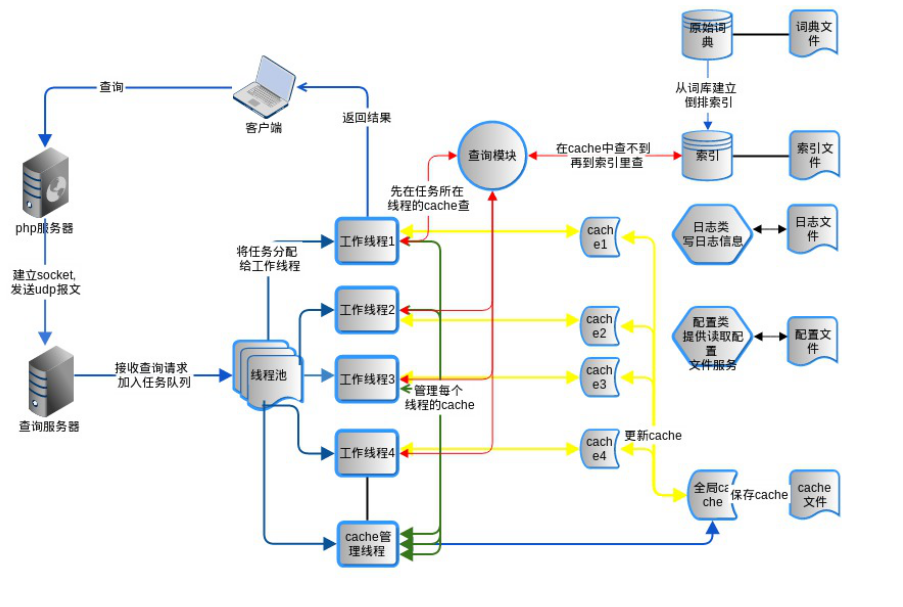
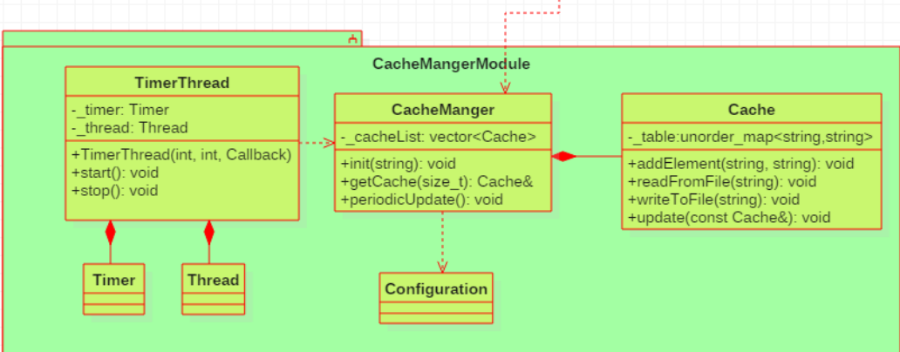
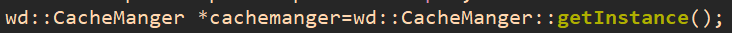
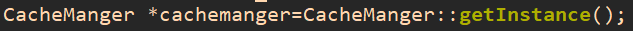
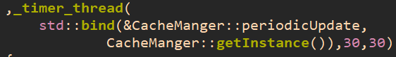
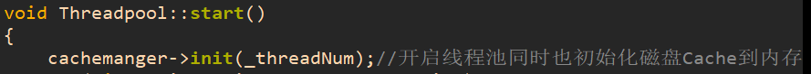
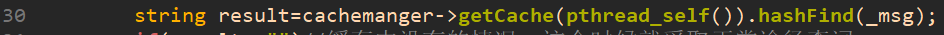
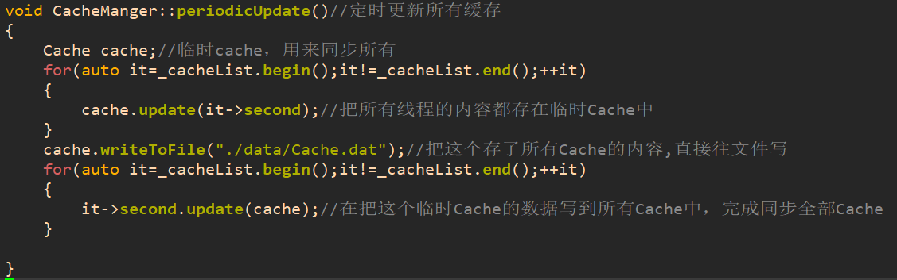

[TOC]
# 项目的查询
* 图1

* 图2

* 表

|Class Cache（缓存类）||
|-|-|
|数据成员：||
|unorderd_map<string, string> _hashMap;|	采用hashTable进行缓存|
|函数成员：||
|Cache(int num = 10)	|构造函数|
|Cache(const Cache & cache)|	构造函数|
|void addElement(const string &key, const string & value)|	往缓存中添加数据|
|void readFromFile(const string & filename)|	从文件中读取缓存信息|
|void writeToFile(const string & filename)|	将缓存信息写入到文件中|
|void update(const Cache & rhs)	|更新缓存信息|

|Class CacheManager（缓存管理类）||
|-|-|
|数据成员：||
|static vector<Cache> _cacheList;	|缓存的数量与线程个数一致|
|函数成员：||
|static void initCache(size_t, const string &filename)|	从磁盘文件中读取缓存信息|
|static Cache & getCache(size_t idx)|	获取某个缓存|
|static void periodicUpdateCaches()|	定时更新所有的缓存|

# 项目逻辑
> 注：表和图都是和文档一模一样的，有改动

以下是所有新加入v4的函数的调用位置
* 初始化(都在Threadpool中初始化)：
1. 首先在需要调用CacheManger的地方，调用全局`CacheManger::getInstance();`，以指针方式接收，获得单例CacheManger，后续操作都以这个管理类进行
    * TestTcpServer.cc : 14 //模拟调用
      
    * Threadpool.cc : 7 //在线程池初始化时，顺便把磁盘Cache读到内存Cache，方便以后分配给线程
     

2.  然后，把TimerThred和线程池组合，构造时初始化绑定了`&CacheManger::periodicUpdate`所以30秒执行一次这个函数，函数功能是同步所有线程独立Cache，同时写到磁盘Cache里保存Cache
    * Threadpool.cc : 11
     
3. 然后，在线程池开启时，初始化内存Cahe，把文件里的内容读到存储Cache的vector里，每个线程的初始Cache都和文件一样
    * Threadpool.cc: 27
        

 以上3步基本都在线程池代码中
    * 时钟线程与线程池组合是为了同步生命周期，其实在main中开启这个时钟也行，生命周期和main同步
    * 在线程池中初始化内存Cache也是感觉舒服一点，也能放在任何合理位置初始化,但是不管哪个位置感觉都会重复执行，放在main函数开始感觉又不好看 

* Task调用(在TestTcpServer.cc里使用)：
1. 因为线程池创建后，初始化已经都完成了，所有操作在Task中完成
2. 首先要调用`cachemanger->getCache(pthread_self())`获得vector中的某个Cache，vector采用`pair<size_t,Cache>`,用自己的线程号，来获得某个Cache，因为线程池就那几个线程，线程号都是固定的，就能一个线程分配一个Cache，其他线程因为线程号不同也不会产生竞争
    * 所有对于vector来说，可能多个线程都在竞争他，但是对于vector中的每个Cache，每个线程都只修改自己的那个Cache互不干扰，测试了3线程，运行不加锁也没事，就“能跑就行了”，没加锁
3. **第三步和第两步的是一起的**，如图
    
    * `getCache(pthread_self())`传回的是一个左值引用，直接调用就是分配给自己的，vector里面的Cache，然后直接调用这个Cache里面的哈希表查找有没有匹配的结果缓存，如果有就直接发给客户端
        * 因为如果拷贝的话，用完Cache操作完之后，还需要重写回CacheManer中的vector中，直接操作vector中一个Cache的引用的话，就直接改了这个Cache，所以直接操作，因为一个线程只会分配对应线程id的Cache，线程之间不会有竞争，所以没上锁也能跑
4. 如果第三步没有找到Cache中的结果，就按正常流程处理
    * 最后按正常流程处理会得到一个要发给客户端的string就是结果，把这个结果（val）和客户输入的string（key）存入缓存中`cachemanger->getCache(pthread_self()).addElement(_msg,result);`
    * 文件中假设查找结果是"bad"

以上4步，完成了客户的查找要求，和查找之后返回给内存Cahche

* 最后，由时钟线程30秒一次，把内存中的Cache写入磁盘Cache
    * 因为读写Cache，其实一直是在用CacheManger类调用参数，读写CacheMagger::vector中的vector，并没有新建Cache，所以只需要把vector中的所有Cache合体，写到每一个Cache中，然后再写一份到磁盘文件中，由时钟线程每30秒调用一次这个函数
    
# 简单懒人版
* 相比于v4版本实现的改变
    * 加入了Cache系列类
        * Cache.hh
        * Cache.cc
        * CacheManger.cc
        * CacheManger.hh
    * 加入了时钟类timer（本来就有的）
        * Timer.cc
        * Timer.hh
        * TimerThread.hh
    * 改变了线程池的start函数，而且组合了一个timerThread
        * Threadpool.cc
        * Threadpool.hh
    * 改变了main函数的Task函数，调用了CacheManger的单例类
        * TestTcpServer.cc
    * Client文件夹是客户端，简单的收发字符串
    * data文件夹里就算磁盘Cache
* CacheManger类的对外接口，调用方式
    * 首先在需要使用的地方得到类指针`cachemanger`，进行操作，因为是单例模式
        * `wd::CacheManger *cachemanger=wd::CacheManger::getInstance();`
    * 赋值CacheManger中的数据，把磁盘Cache存入vector中的所有Cache
        * `cachemanger->init(_threadNum);`
    * 在CacheManger分给线程的Cache中，查找数据
        * `cachemanger->getCache(pthread_self()).hashFind(_msg);`
    * 以非缓存的方式查找到，在CacheManger分给线程的Cache中，更新数据
        * `cachemanger->getCache(pthread_self()).addElement(_msg,result);`
    * 被时钟线程30秒调用一次，同步所有Cache，再向磁盘Cache文件中写一份
        * `std::bind(&CacheManger::periodicUpdate,CacheManger::getInstance()),30,30`
    
* CacheManger.cc 中有两处涉及磁盘读写的操作，我把文件地址写死了，第二处因为时钟线程能接收的函数是形式是void()，如果要改，还要改这个
